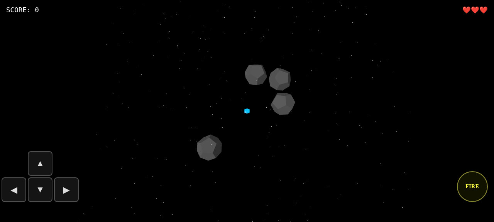

# Three.js Game Dev Starter Pack

**Go from zero to a playable browser game — with any AI agent, in a single session.**

Clone it. Describe your game. Start building.

No blank canvas paralysis. No setup friction. No fighting your agent to stay on track — the architecture rules and skill files are already wired in.



> 🎬 *Cube Runner · Asteroids · Block Breaker — all built from this kit in a single agent session each.*

---

> 🚀 **Pro Kit — coming soon**
> React Three Fiber architecture, real project structure, case study branches, and a Vercel-ready deploy. Subscribe on Gumroad to get notified when it drops + lock in launch pricing.
> [→ Subscribe for early access](https://heagandev.gumroad.com)

---

## What's Inside

| | |
|---|---|
| ⚙️ | **Vite + TypeScript + Three.js** — zero config, runs instantly |
| 🧠 | **11 Three.js skill files** your agent loads automatically — no explaining Three.js every session |
| 📐 | **`AGENTS.md`** — architecture rules that keep your agent on track |
| 🌿 | **Clean `src/main.ts`** — your game starts here, not someone else's |

---

## Quickstart

```bash
git clone https://github.com/heagandev/threejs-agent-starter
cd threejs-agent-starter
git checkout new-game
npm install
npm run dev
```

Open [http://localhost:5173](http://localhost:5173) — you'll see a blank canvas. Your game starts here.

---

## Building Your Prototype

This kit works with any AI coding agent — Claude Code, Codex, Cursor, Windsurf, Copilot, or any tool that reads files from your repo.

**Recommended workflow:**

```bash
# 1. Create a branch for your game
git checkout -b my-game

# 2. Open your agent and describe what you want to build
# The agent reads AGENTS.md automatically and follows the architecture rules

# 3. Iterate — review output, run it, commit when it works
git add -A && git commit -m "feat: initial game prototype"
```

**Three questions to get started — that's all your agent needs:**

- What kind of game? (top-down shooter, platformer, puzzle, arcade...)
- What is the player doing every second?
- What ends the game?

The kit handles the rest — renderer setup, game loop, resize handling, delta capping, clean class structure.

---

## Want to see the workflow before you build?

Check out the example branches — each was built from this `new-game` branch using the `/plan` prompt and a single agent session:

- [`cube-runner`](../../tree/cube-runner) — dodge game, ready to extend with prompt files
- [`asteroids`](../../tree/asteroids) — ship, bullets, asteroid splitting, waves
- [`block-breaker`](../../tree/block-breaker) — paddle, multi-ball, levels

---

## Skills

The `skills/` folder contains Three.js reference sheets. Your agent loads them automatically via `AGENTS.md` — you don't need to explain Three.js in every prompt.

| Skill | Covers |
|---|---|
| `threejs-fundamentals.md` | Scene, camera, renderer, transforms |
| `threejs-lighting.md` | Lights, shadows |
| `threejs-geometry.md` | Shapes, BufferGeometry |
| `threejs-interaction.md` | Input, raycasting |
| `threejs-animation.md` | Keyframes, procedural motion, spring physics |
| `threejs-materials.md` | Materials, PBR |
| `threejs-textures.md` | Texture loading, mapping |
| `threejs-shaders.md` | GLSL, ShaderMaterial |
| `threejs-postprocessing.md` | Bloom, effects |
| `threejs-loaders.md` | GLTF, asset loading |
| `threejs-game.md` | Game loop, input, collision, HUD, audio, game-feel patterns |

---

## What to Build

Some directions worth exploring once your core loop is working:

- **Mobile controls** — touch/swipe input for mobile players
- **Game juice** — screen shake, hit flash, score milestones
- **Procedural generation** — infinite levels from a seed
- **Spatial audio** — sound design with the Web Audio API
- **Custom shaders** — visual effects via `skills/threejs-shaders.md`
- **Leaderboard** — score submission with a simple backend

Each one makes a great focused agent session. Open a branch, describe the feature, review and commit.

---

## Stack

- [Vite](https://vitejs.dev/) — build tool
- [Three.js](https://threejs.org/) — 3D rendering
- TypeScript — type safety

---

## License

MIT — free to use, extend, and ship.

---

## Want More?

This is the free starter. Here's what the paid kits add:

| Kit | What you get | Price |
|---|---|---|
| **Pro Kit** | React Three Fiber architecture, real project structure, case study branches, Vercel deploy | $49 at launch → $79 |
| **Pro Plus** | Everything in Pro + ESLint/Husky guardrails, AI memory system, advanced prompts | $79 at launch → $99 |

[→ See all kits on Gumroad](https://heagandev.gumroad.com)