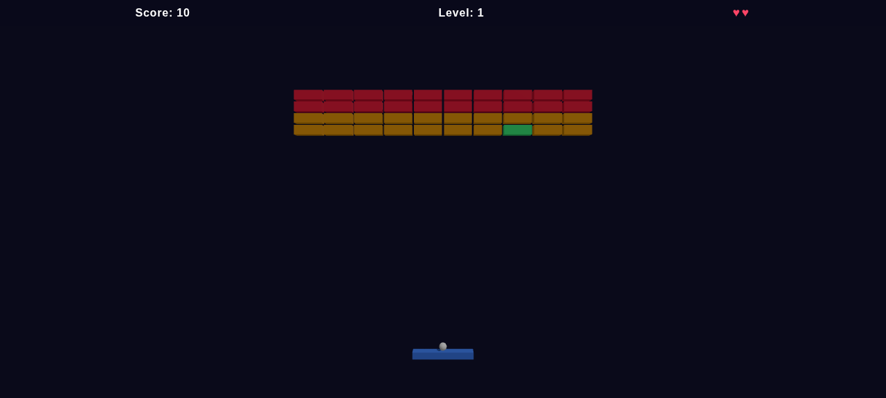

# Three.js Game Dev Starter Pack — Block Breaker

**A working Three.js block breaker — built from the starter kit using the `/plan` prompt and a single agent session.**

Clone it. Run it. Extend it with your agent, or use it as a reference for building your own game.

> 🚀 **Want the production-ready upgrade?**
> The **Pro Kit** gives you a full React Three Fiber architecture, real project structure, case study branches, and Vercel deploy — at launch pricing.
> [→ Upgrade to the Pro Kit](https://heagandev.gumroad.com/l/hdev-starter)

---



---

## What's Inside

| | |
|---|---|
| 🎮 | **Block Breaker** — paddle, multi-ball, block HP, power-ups, levels |
| 🧠 | **11 Three.js skill files** your agent loads automatically |
| 📋 | **Prompt files** to extend the game feature by feature |
| 📐 | **`AGENTS.md`** — architecture rules that keep your agent on track |
| 🌿 | **`new-game` branch** — blank canvas + `/plan` prompt to design your own game from scratch |

---

## Quickstart

```bash
git clone https://github.com/heagandev/threejs-agent-starter
cd threejs-agent-starter
git checkout block-breaker
npm install
npm run dev
```

Open [http://localhost:5173](http://localhost:5173) — the game runs immediately.

Controls: mouse or `A`/`D` to move paddle · keep the ball alive · clear all blocks

---

## How This Was Built

This branch was created from `new-game` using the `/plan` prompt to design the game, then a single agent session to build it:

```bash
git checkout new-game
git checkout -b block-breaker-game
# paste prompts/block-breaker-mvp.md into your agent
```

That's the workflow the kit is built around — one branch per game, one agent session per feature.

---

## Building With Your Agent

Paste any prompt file into your agent to add a feature:

| Prompt | What it builds |
|---|---|
| `/plan` | Plan a new game from scratch |
| `/power-ups` | Add a power-up system |
| `/game-juice` | Screen shake, squash/stretch, score milestones |

**Recommended workflow:**

```bash
# Start a new feature on its own branch
git checkout -b feat/power-ups

# Paste prompts/power-ups.md into your agent
# Review the output, then commit when it works
git add -A && git commit -m "feat: add power-up system"
```

---

## Skills

The `skills/` folder contains Three.js reference sheets. Your agent loads them via `AGENTS.md`.

| Skill | Covers |
|---|---|
| `threejs-fundamentals.md` | Scene, camera, renderer, transforms |
| `threejs-lighting.md` | Lights, shadows |
| `threejs-geometry.md` | Shapes, BufferGeometry |
| `threejs-interaction.md` | Input, raycasting |
| `threejs-animation.md` | Keyframes, procedural motion, spring physics |
| `threejs-materials.md` | Materials, PBR |
| `threejs-textures.md` | Texture loading, mapping |
| `threejs-shaders.md` | GLSL, ShaderMaterial |
| `threejs-postprocessing.md` | Bloom, effects |
| `threejs-loaders.md` | GLTF, asset loading |
| `threejs-game.md` | Game loop, input, collision, HUD, audio, game-feel |

---

## Stack

- [Vite](https://vitejs.dev/) — build tool
- [Three.js](https://threejs.org/) — 3D rendering
- TypeScript — type safety

---

## License

MIT — free to use, extend, and ship.

---

## Want More?

This is the free starter. Here's what the paid kits add:

| Kit | What you get | Price |
|---|---|---|
| **Pro Kit** | React Three Fiber architecture, real project structure, case study branches, Vercel deploy | $49 at launch → $79 |
| **Pro Plus** | Everything in Pro + ESLint/Husky guardrails, AI memory system, prompts to /10 | $79 at launch → $99 |

[→ Get early access and launch pricing at heagan.dev](https://heagandev.gumroad.com/l/hdev-starter)
