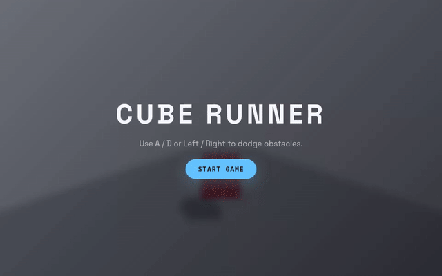

# Three.js Game Dev Starter Pack — Cube Runner

**A working Three.js browser game — ready to extend with any AI agent.**

Clone it. Run it. Paste a prompt. Start building.

No blank canvas. No setup friction. No fighting your AI to stay on track — the architecture rules and skill files are already wired in.

> 🚀 **Want the production-ready upgrade?**
> The **Pro Kit** gives you a full React Three Fiber architecture, real project structure, case study branches, and Vercel deploy — at launch pricing.
> [→ Upgrade to the Pro Kit](https://heagandev.gumroad.com/l/hdev-starter) <!-- replace with Gumroad link -->

---

<!-- Replace with actual GIF or screenshot once ready -->


---

## What's Inside

| | |
|---|---|
| 🎮 | **Cube Runner** — a fully playable dodge game, ready to extend |
| 🧠 | **11 Three.js skill files** your agent loads automatically |
| 📋 | **4 prompt files** to extend the game feature by feature |
| 📐 | **`AGENTS.md`** — architecture rules that keep your agent on track |
| 🌿 | **`new-game` branch** — blank canvas + `/plan` prompt to design your own game from scratch |

---

## Quickstart

```bash
git clone https://github.com/heagandev/threejs-agent-starter
cd threejs-agent-starter
npm install
npm run dev
```

Open [http://localhost:5173](http://localhost:5173) — the game runs immediately.

---

## Building With Your Agent

This kit is designed to work with any AI coding agent — Claude Code, Codex, Cursor, Windsurf, Copilot, or any tool that reads files from your repo.

Paste any prompt file into your agent to add a feature:

| Prompt | What it builds |
|---|---|
| `/power-ups` | Speed boost, shield, and slow-mo power-up system |
| `/game-juice` | Screen shake, squash/stretch, score milestones |
| `/level-two` | A second level with transitions |
| `/plan` | Plan an entirely new game from scratch (`git checkout new-game` first) |

**Recommended workflow:**

```bash
# Start a new feature on its own branch
git checkout -b feat/power-ups

# Paste prompts/power-ups.md into your agent
# Review the output, then commit when it works

git add -A && git commit -m "feat: add power-up system"
```

Your agent reads `AGENTS.md` automatically and follows the architecture rules — no extra setup needed.

---

## Skills

The `skills/` folder contains Three.js reference sheets. Your agent loads them via `AGENTS.md`, or you can reference them directly in any prompt.

| Skill | Covers |
|---|---|
| `threejs-fundamentals.md` | Scene, camera, renderer, transforms |
| `threejs-lighting.md` | Lights, shadows |
| `threejs-geometry.md` | Shapes, BufferGeometry |
| `threejs-interaction.md` | Input, raycasting |
| `threejs-animation.md` | Keyframes, procedural motion, spring physics |
| `threejs-materials.md` | Materials, PBR |
| `threejs-textures.md` | Texture loading, mapping |
| `threejs-shaders.md` | GLSL, ShaderMaterial |
| `threejs-postprocessing.md` | Bloom, effects |
| `threejs-loaders.md` | GLTF, asset loading |
| `threejs-game.md` | Game loop, input, collision, HUD, audio, game-feel patterns |

---

## What to Build Next

Once you've run through the included prompts, here are directions worth exploring:

- **Make other games** — checkout `new-game` branch and use `/plan` to design something original with your agent
- **Mobile controls** — add touch/swipe input for mobile players
- **Leaderboard** — score submission with a simple backend
- **Custom shaders** — visual effects via `skills/threejs-shaders.md`
- **Spatial audio** — sound design with the Web Audio API
- **Level editor** — let players build their own obstacle layouts
- **Procedural generation** — infinite levels from a seed

Each one makes a great agent session. Open a branch, paste a prompt, review and commit.

---

## Stack

- [Vite](https://vitejs.dev/) — build tool
- [Three.js](https://threejs.org/) — 3D rendering
- TypeScript — type safety

---

## License

MIT — free to use, extend, and ship.

---

## Want More?

This is the free starter. Here's what the paid kits add:

| Kit | What you get | Price |
|---|---|---|
| **Pro Kit** | React Three Fiber architecture, real project structure, case study branches, Vercel deploy | $49 at launch → $79 |
| **Pro Plus** | Everything in Pro + ESLint/Husky guardrails, AI memory system, prompts to /10 | $79 at launch → $99 |

[→ Get early access and launch pricing at heagan.dev](https://heagandev.gumroad.com/l/hdev-starter) <!-- replace with Gumroad link -->